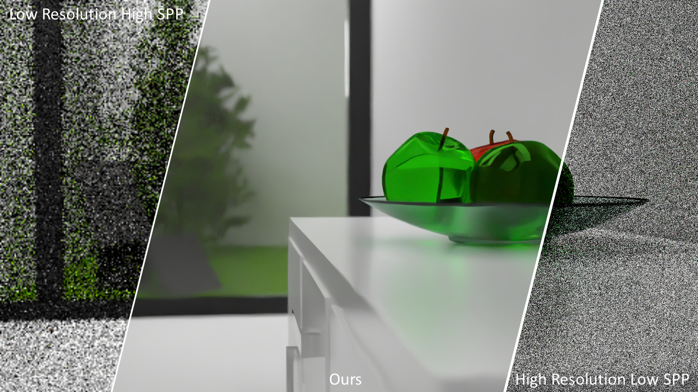
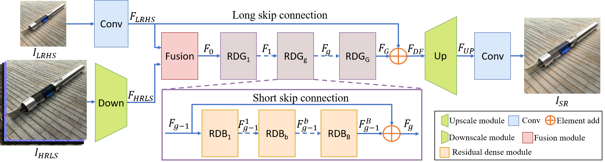
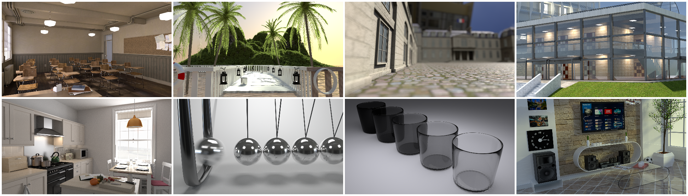

# Fast Monte Carlo Rendering via Multi-Resolution Sampling

### [Paper](https://arxiv.org/abs/2106.12802) | Data | [Youtube](https://www.youtube.com/watch?v=u_LS7feS-hQ) 

The data is currently reviewed by Intel. We will make it public as soon as possible.

PyTorch implementation of fast Monte Carlo rendering via multi-resolution sampling.<br><br>
Fast Monte Carlo Rendering via Multi-Resolution Sampling, <br>
 [Qiqi Hou](https://hqqxyy.github.io/) \*<sup>1</sup>,
 Zhan Li\*<sup>1</sup>,
 Carl S Marshall<sup>2</sup>,
 Selvakumar Panneer<sup>2</sup>,
 [Feng Liu](http://web.cecs.pdx.edu/~fliu/) <sup>1</sup>, <br>
 <sup>1</sup>Portland State University, <sup>2</sup>Intel 
 
in Graphic Interface 2021.

 


## What is a MSSPL?

MultiScale-SamPLing (MSSPL) is a hybrid rendering method to speed up Monte Carlo rendering algorithms.
It first generates two versions of a rendering: one at a low resolution 
with a high sample rate (LRHS) and the other at a high resolution with a low sample rate (HRLS). 
We develop a deep convolutional neural network to fuse these two renderings into a high-quality image 
as if it were rendered at a high resolution with a high sample rate. Specifically, we formulate this fusion task 
as a super resolution problem that generates a high resolution rendering from a low resolution input (LRHS), 
assisted with the HRLS rendering. LRHS is less noisy while the more noisy HRLS can potentially provide high-frequency visual details
that are inherently difficult to recover from the low resolution image.

Traing a MSSPL takes between five days and one week and only requires a single GPU. 
Denoising one 1024*1024 image from an optimized MSSPL takes about 0.12 second for our x4 model on a Titan Xp.

 

### Training 
We will release our training code.

### Inference Demo
We will release a demo code for inference.

### Replicating the paper results
We will release our code, models and our results. 

## BCR Dataset
We collected a large scale Blender Cycles Ray-tracing (BCR) dataset, 
which contains 2449 high-quality images rendered from 1463 models. 
We render the images at a range of spp rates, including 1-8, 12, 16, 32, 64, 250, 1000, and 4000 spp. 
All the images are rendered at the resolution of 1080p. 
Each image contains not only the final rendered result but also the intermediate render layers, 
including albedo, normal, diffuse, glossy, and so on. We provide an example of intermediate layers at [here](figures/layers.png).

We will release the whole dataset as well as the compared results on our dataset.

 

## Citation
```
@inproceedings{hou2021msspl,
  title={Fast Monte Carlo Rendering via Multi-Resolution Sampling},
  author={Qiqi Hou, Zhan Li, Carl S Marshall, Selvakumar Panneer, Feng Liu},
  year={2021},
  booktitle={Graphic Interface},
}
```

## Acknowledgments
The source models in figures are used under a Creative Commons License from kujaba, 
darkst0ne, cczero, LukeLiptak, Christophe Seux, nickbrunner, samytichadou, MarcoD, Jay-Artist, 
jgilhutton, Oldfrizt, Ndakasha, GyngaNynja, racingfoli, Kless and PepSu. 
This project is supported by a gift from Intel.
